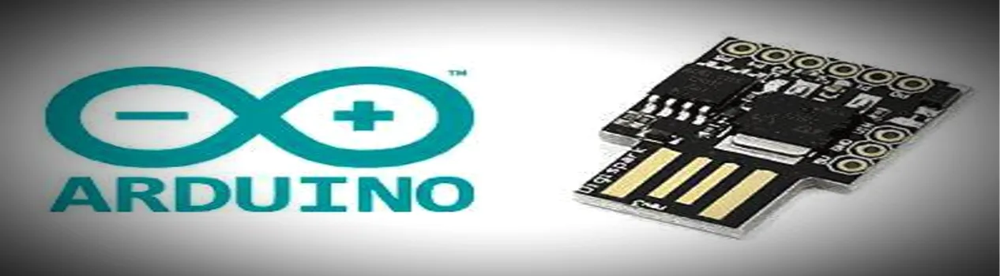

<h1>
<i>The ultimate guide to understanding how to program and use Digispark microcontroller </i>
</h1>

          

 
                                     ╔═           ═╗
<h2>
<i>╚══════════ Introduction ══════════╝</i>
</h2>
<em>
 Digispark is a tiny, Arduino-compatible development board based on the ATtiny85 microcontroller. In this guide, we will cover the definition, history, technical specifications, advantages and disadvantages, programming fundamentals, understanding the ATtiny85 microcontroller, and programming languages for Digispark development.</em>

<h2>1. Definition of Digispark</h2> <h3 style="color:Tomato;">Hello World</h3>
<em>
 Digispark is a low-cost, open-source, tiny-sized development board that is used for rapid prototyping and DIY projects. It is Arduino-compatible, and it uses the ATtiny85 microcontroller.</em>

<h2>2. History and Development of Digispark</h2>
<em>
 Digispark was developed by Erik Kettenburg, a software developer and electronics hobbyist, in 2012. He wanted to create a low-cost, easy-to-use development board that would be accessible to everyone. The first version of Digispark was based on the ATtiny45 microcontroller, and it was released as an open-source project. Later, the board was upgraded to the ATtiny85 microcontroller</em>.

<h2>3. Technical Specifications and Capabilities of Digispark</h2>
<em>
 Digispark is a small development board that measures only 1.8 cm x 2.5 cm. It is powered by a 5V USB connection, and it has 6 I/O pins, including 3 analog pins. It can be programmed using the Arduino IDE, and it can be used to control LEDs, motors, and sensors.</em>

<h2>4. Advantages and Disadvantages of Using Digispark</h2>
<em>
 One of the main advantages of Digispark is its small size, which makes it ideal for small projects and wearable electronics. It is also low-cost, easy-to-use, and compatible with the Arduino IDE. However, its limited number of I/O pins and memory can be a disadvantage for more complex projects.</em>

<h2>5. Digispark Programming Fundamentals</h2>
<em>
 Digispark can be programmed using the Arduino IDE, which is a simple, user-friendly programming environment. It uses the C++ programming language, and it allows you to easily upload your code to the Digispark board. However, because of its limited memory, you may need to optimize your code for size.</em>

<h2>6. Understanding the ATtiny85 Microcontroller</h2>
<em>
 The ATtiny85 microcontroller is the heart of Digispark. It is a low-power, 8-bit microcontroller with 8 KB of flash memory and 512 bytes of RAM. It has 6 I/O pins, including 3 analog pins, and it can be used for a wide range of applications, from controlling LEDs to driving motors.
</eme>

<h2>7. Programming Languages for Digispark Development</h2>
<em>
 In addition to the Arduino IDE, Digispark can be programmed using other programming languages, such as C, C++, Python, and Assembly. Each language has its own advantages and disadvantages, and choosing the right language depends on the complexity of your project and your programming skills.
</em>

<h2>
<i>Conclusion</i>
</h2>
<em>
 Digispark is a versatile, low-cost, and easy-to-use development board that is ideal for small DIY projects and wearable electronics. It uses the ATtiny85 microcontroller and can be programmed using the Arduino IDE or other programming languages. With its small size, it is perfect for beginners and advanced users alike.
</em>

